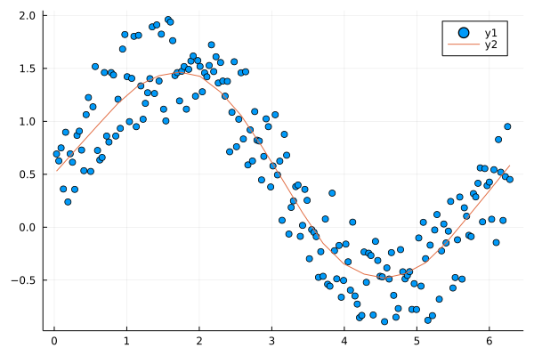

# Lowess

[](https://xKDR.github.io/Lowess.jl/dev)


[](https://codecov.io/gh/xKDR/Lowess.jl)

This package is an alternative to https://github.com/JuliaStats/Loess.jl

## To install: 
```Julia
 add "https://github.com/xKDR/Lowess.jl.git"
```

This is a pure Julia lowess implementation. The lowess.c code from https://github.com/wch/r-source/blob/trunk/src/library/stats/src/lowess.c has been hand-translated to Julia. 

## Synopsis

`Lowess` exports two functions, `lowess` and `lowess_model`. The `lowess` function returns the predict y-values for the input x-values. The `lowess_model` function returns a function that can be used to predict the y value for any given x value (which lies within the extrema of input x-values).   
The amount of smoothing is mainly controlled by the `f` keyword argument. E.g.:


```julia
using Lowess, Plots

xs = 10 .* rand(100)
xs = sort(xs)
ys = sin.(xs) .+ 0.5 * rand(100)

model = lowess_model(xs, ys, 0.2)

us = range(extrema(xs)...; step = 0.1)
vs = model(us)

scatter(xs, ys)
plot!(us, vs, legend=false)
```

# Benchmarks

```julia
using BenchmarkTools, using Loess, using Lowess
xs = 10 .* rand(100)
xs = sort(xs)
ys = sin.(xs) .+ 0.5 * rand(100)

@benchmark begin
model = loess(xs, ys, span=0.5)
us = range(extrema(xs)...; step = 0.1)
vs = predict(model, us)
end 
```
```
BenchmarkTools.Trial: 6040 samples with 1 evaluation.
 Range (min … max):  574.949 μs …   3.726 ms  ┊ GC (min … max):  0.00% … 64.41%
 Time  (median):     693.659 μs               ┊ GC (median):     0.00%
 Time  (mean ± σ):   825.584 μs ± 515.006 μs  ┊ GC (mean ± σ):  16.85% ± 18.90%
```

```julia
@benchmark begin
model = lowess_model(xs, ys, 0.2)
us = range(extrema(xs)...; step = 0.1)
vs = model(us)
end
```
```
BenchmarkTools.Trial: 10000 samples with 1 evaluation.
 Range (min … max):  47.797 μs …  1.420 ms  ┊ GC (min … max): 0.00% … 95.55%
 Time  (median):     58.236 μs              ┊ GC (median):    0.00%
 Time  (mean ± σ):   58.842 μs ± 15.965 μs  ┊ GC (mean ± σ):  0.23% ±  0.96%
```
```julia
@benchmark lowess(xs, ys, 0.2)
```
```
BenchmarkTools.Trial: 10000 samples with 1 evaluation.
 Range (min … max):  46.183 μs … 316.997 μs  ┊ GC (min … max): 0.00% … 0.00%
 Time  (median):     56.525 μs               ┊ GC (median):    0.00%
 Time  (mean ± σ):   57.325 μs ±   7.577 μs  ┊ GC (mean ± σ):  0.00% ± 0.00%
```



## References in Loess.jl
[1] Cleveland, W. S. (1979). Robust locally weighted regression and smoothing scatterplots. Journal of the American statistical association, 74(368), 829-836. DOI: 10.1080/01621459.1979.10481038

[2] Cleveland, W. S., & Devlin, S. J. (1988). Locally weighted regression: an approach to regression analysis by local fitting. Journal of the American statistical association, 83(403), 596-610. DOI: 10.1080/01621459.1988.10478639

[3] Cleveland, W. S., & Grosse, E. (1991). Computational methods for local regression. Statistics and computing, 1(1), 47-62. DOI: 10.1007/BF01890836

